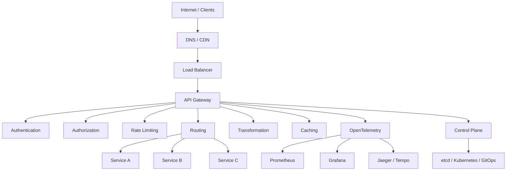
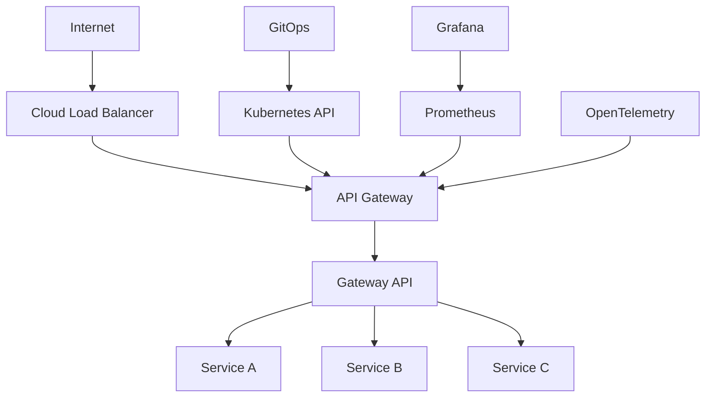

# Awesome-API-Gateway

# 🚪 Top API Gateways & Open-Source API Gateway Software


> A curated list of **API Gateways, API Management platforms, cloud API gateways, Kubernetes gateways and open-source API gateway software** for routing, securing, governing and observing APIs.


An API Gateway sits at the edge of an application or microservices platform and commonly provides:


* Request routing

* Load balancing

* Authentication and authorization

* TLS termination

* Rate limiting

* Quotas

* API keys

* JWT / OAuth / OIDC

* Traffic transformation

* Request / response transformation

* Caching

* Circuit breaking

* Canary releases

* API versioning

* Observability

* Developer portals

* API policies

* Monetization

* Service discovery

* WebSocket / gRPC support

* Kubernetes / Gateway API integration

* AI / LLM traffic management


This repository focuses primarily on **open-source and self-hostable API gateways**, while maintaining a separate list of hosted and commercial platforms such as Kong Konnect, Google Apigee, Tyk, Gravitee, MuleSoft, Azure API Management, AWS API Gateway, IBM API Connect and WSO2.


> **Important distinction:** an API Gateway is not necessarily the same thing as a complete API Management platform. A gateway primarily handles runtime traffic, while API management can additionally include API design, lifecycle management, developer portals, analytics, governance, monetization and organizational workflows.


---


## 📑 Table of Contents


* [☁️ SaaS/Hosted Platforms](#️-saashosted-platforms)

* [🌍 Open-Source](#-open-source)

* [🚪 Open-Source API Gateways](#-open-source-api-gateways)

* [☸️ Kubernetes & Cloud-Native API Gateways](#️-kubernetes--cloud-native-api-gateways)

* [⚡ High-Performance API Gateways](#-high-performance-api-gateways)

* [🔀 API Gateway & Reverse Proxy Software](#-api-gateway--reverse-proxy-software)

* [🧩 Service Mesh & Programmable Proxies](#-service-mesh--programmable-proxies)

* [🔐 Open-Source API Security](#-open-source-api-security)

* [🚦 Open-Source Traffic Management](#-open-source-traffic-management)

* [📊 Open-Source API Gateway Observability](#-open-source-api-gateway-observability)

* [🛠️ Open-Source API Gateway Control Planes](#️-open-source-api-gateway-control-planes)

* [🤖 Open-Source AI Gateways](#-open-source-ai-gateways)

* [🧩 Commercial Platform → Open-Source Equivalent](#-commercial-platform--open-source-equivalent)

* [🏗️ API Gateway Architecture](#️-api-gateway-architecture)

* [🔄 Open-Source API Gateway Architecture](#-open-source-api-gateway-architecture)

* [☸️ Kubernetes API Gateway Architecture](#️-kubernetes-api-gateway-architecture)

* [🔐 API Security Architecture](#-api-security-architecture)

* [📊 API Gateway Technology Comparison](#-api-gateway-technology-comparison)

* [⚖️ Commercial vs Open-Source](#️-commercial-vs-open-source)

* [🚀 Recommended Open-Source Stacks](#-recommended-open-source-stacks)

* [🎯 Recommended Projects by Use Case](#-recommended-projects-by-use-case)

* [🏢 Building a Kong Alternative](#-building-a-kong-alternative)

* [🏗️ Building an Apigee Alternative](#️-building-an-apigee-alternative)

* [🌐 Open-Source API Gateway Landscape](#-open-source-api-gateway-landscape)

* [🧠 API Gateway Layers](#-api-gateway-layers)

* [🔥 Why Open-Source API Gateways Matter](#-why-open-source-api-gateways-matter)

* [🤝 Contributing](#-contributing)

* [⚠️ Disclaimer](#️-disclaimer)


---


# ☁️ SaaS/Hosted Platforms


Commercial and managed API gateway platforms combine runtime traffic management with varying degrees of API lifecycle management, analytics, governance and developer tooling.


| Platform                                                                                        | Company      | Primary Focus                           | Key Capabilities                                                                       |

| ----------------------------------------------------------------------------------------------- | ------------ | --------------------------------------- | -------------------------------------------------------------------------------------- |

| [Kong Konnect](https://konghq.com/products/kong-konnect)                                        | Kong         | Cloud API platform                      | API Gateway, service connectivity, governance, analytics and AI Gateway                |

| [Google Apigee](https://cloud.google.com/apigee)                                                | Google Cloud | Enterprise API Management               | Gateway, policies, analytics, developer portals, monetization and lifecycle management |

| [Tyk Cloud](https://tyk.io/)                                                                    | Tyk          | API Management                          | Gateway, API management, GraphQL, analytics and developer portal                       |

| [Gravitee](https://www.gravitee.io/)                                                            | Gravitee     | API Management                          | REST, event APIs, security, gateway, portal and governance                             |

| [MuleSoft Anypoint API Manager](https://www.mulesoft.com/platform/api)                          | Salesforce   | Enterprise integration + API Management | Gateway, policies, lifecycle, analytics and integration                                |

| [Azure API Management](https://azure.microsoft.com/products/api-management/)                    | Microsoft    | Cloud API Management                    | Gateway, policies, developer portal, analytics and hybrid deployment                   |

| [Amazon API Gateway](https://aws.amazon.com/api-gateway/)                                       | AWS          | Managed cloud gateway                   | REST, HTTP, WebSocket APIs, throttling and AWS integration                             |

| [IBM API Connect](https://www.ibm.com/products/api-connect)                                     | IBM          | Enterprise API Management               | Gateway, lifecycle, security, analytics and developer portal                           |

| [WSO2 API Manager](https://wso2.com/api-manager/)                                               | WSO2         | Full API lifecycle                      | Gateway, lifecycle, security, analytics and developer portal                           |

| [Traefik Hub](https://traefik.io/traefik-hub/)                                                  | Traefik      | Cloud-native API management             | Kubernetes gateway, ingress, API management and observability                          |

| [NGINX Plus](https://www.nginx.com/products/nginx/)                                             | F5           | High-performance gateway                | Reverse proxy, load balancing, API gateway and security                                |

| [KrakenD Enterprise](https://www.krakend.io/)                                                   | KrakenD      | API Gateway / API Aggregation           | High-performance gateway, aggregation, security and enterprise management              |

| [Gloo Gateway](https://www.solo.io/products/gloo-gateway)                                       | Solo.io      | Kubernetes API Gateway                  | Envoy-based gateway, Gateway API and enterprise management                             |

| [AWS AppSync](https://aws.amazon.com/appsync/)                                                  | AWS          | GraphQL API layer                       | Managed GraphQL gateway and API integration                                            |

| [Azure Application Gateway](https://azure.microsoft.com/products/application-gateway/)          | Microsoft    | Application gateway                     | L7 routing, TLS, WAF and load balancing                                                |

| [Cloudflare API Gateway](https://www.cloudflare.com/application-services/products/api-gateway/) | Cloudflare   | Edge API security                       | API discovery, security, rate limiting and edge traffic management                     |


The current API gateway landscape spans gateway-first products such as Kong, Tyk and APISIX, full API-management platforms such as Apigee and WSO2, and cloud-native gateways such as Gloo Gateway.


---


# 🌍 Open-Source


The open-source API gateway ecosystem is unusually strong.


Instead of buying a complete proprietary platform, organizations can assemble an API platform from:


```text

                         OPEN-SOURCE API PLATFORM

                                    │

             ┌──────────────────────┼──────────────────────┐

             │                      │                      │

             ▼                      ▼                      ▼

       API Gateway             Control Plane          Developer Portal

             │                      │                      │

             ▼                      ▼                      ▼

       APISIX / Kong            etcd / GitOps       Backstage / Docs

       Tyk / Gravitee           Kubernetes          Custom Portal

       Envoy / Traefik

             │

             ▼

      Security + Policies

             │

             ▼

      Observability + Analytics

```


The strongest open-source projects include:


* Apache APISIX

* Kong Gateway

* Tyk Gateway

* Gravitee

* WSO2 API Manager

* Traefik

* Envoy

* Envoy Gateway

* KrakenD

* Apache ShenYu

* Higress

* Gloo Gateway / kgateway

* HAProxy

* NGINX

* Caddy

* Zuul

* Spring Cloud Gateway


Apache APISIX, Kong, Envoy and Traefik are among the major open-source gateway choices, with materially different configuration, extension and deployment models.


---


# 🚪 Open-Source API Gateways


| Project                                                                      | Language / Foundation | Primary Strength                       | License         |

| ---------------------------------------------------------------------------- | --------------------- | -------------------------------------- | --------------- |

| [Apache APISIX](https://github.com/apache/apisix)                            | Lua / NGINX / etcd    | Dynamic high-performance API gateway   | Apache-2.0      |

| [Kong Gateway](https://github.com/Kong/kong)                                 | Lua / NGINX           | Mature plugin ecosystem                | Apache-2.0 core |

| [Tyk Gateway](https://github.com/TykTechnologies/tyk)                        | Go                    | API gateway + GraphQL                  | MPL-2.0         |

| [Gravitee](https://github.com/gravitee-io/gravitee-api-management)           | Java                  | API + event management                 | Apache-2.0 core |

| [Traefik Proxy](https://github.com/traefik/traefik)                          | Go                    | Cloud-native ingress / gateway         | MIT             |

| [Envoy Proxy](https://github.com/envoyproxy/envoy)                           | C++                   | Programmable L4/L7 proxy               | Apache-2.0      |

| [Envoy Gateway](https://github.com/envoyproxy/gateway)                       | Go / Envoy            | Kubernetes Gateway API                 | Apache-2.0      |

| [KrakenD Community Edition](https://github.com/krakendio/krakend-ce)         | Go                    | High-performance API aggregation       | Apache-2.0      |

| [Apache ShenYu](https://github.com/apache/shenyu)                            | Java                  | Extensible API gateway                 | Apache-2.0      |

| [Higress](https://github.com/alibaba/higress)                                | Go / Envoy            | Cloud-native gateway                   | Apache-2.0      |

| [Gloo Gateway](https://github.com/kgateway-dev/kgateway)                     | Go / Envoy            | Kubernetes Gateway API                 | Apache-2.0      |

| [HAProxy](https://github.com/haproxy/haproxy)                                | C                     | High-performance proxy / load balancer | GPL-2.0         |

| [NGINX](https://github.com/nginx/nginx)                                      | C                     | Reverse proxy / gateway foundation     | BSD-2-Clause    |

| [Caddy](https://github.com/caddyserver/caddy)                                | Go                    | Simple modern reverse proxy            | Apache-2.0      |

| [Spring Cloud Gateway](https://github.com/spring-cloud/spring-cloud-gateway) | Java                  | Spring-native API gateway              | Apache-2.0      |

| [Zuul](https://github.com/Netflix/zuul)                                      | Java                  | JVM edge proxy                         | Apache-2.0      |

| [Krakend](https://github.com/krakendio/krakend-ce)                           | Go                    | API aggregation                        | Apache-2.0      |


Apache APISIX is an Apache Software Foundation top-level project built on NGINX and etcd, with dynamic routing and a large plugin ecosystem. Its current project site describes more than 100 open-source plugins and support for Kubernetes, authentication, rate limiting, observability and AI gateway workloads.


---


# 🥇 Apache APISIX


[Apache APISIX](https://github.com/apache/apisix) is one of the strongest fully open-source choices for organizations seeking a high-performance API gateway.


```text

                    Client

                      │

                      ▼

                Apache APISIX

                      │

          ┌───────────┼───────────┐

          ▼           ▼           ▼

       Auth        Routing     Rate Limit

          │           │           │

          └───────────┼───────────┘

                      ▼

                 Upstream

```


Key capabilities include:


* Dynamic routing

* Authentication

* Rate limiting

* Load balancing

* Circuit breaking

* Request transformation

* gRPC

* WebSocket

* OpenID Connect

* Prometheus

* OpenTelemetry

* Kubernetes

* Service discovery

* AI / LLM gateway capabilities


APISIX uses etcd for dynamic configuration and supports hot-loading plugins without gateway restarts.


---


# 🦍 Kong Gateway


[Kong Gateway](https://github.com/Kong/kong) is one of the most mature API gateway ecosystems.


```text

                       Kong Gateway

                            │

        ┌───────────────────┼───────────────────┐

        │                   │                   │

        ▼                   ▼                   ▼

 Authentication        Rate Limiting       Transformations

        │                   │                   │

        └───────────────────┼───────────────────┘

                            ▼

                       Microservices

```


Kong supports:


* DB-backed configuration

* DB-less mode

* Hybrid deployment

* Kubernetes

* Plugins

* Authentication

* Rate limiting

* Observability

* GraphQL

* gRPC

* WebSocket

* AI gateway workloads


Kong and APISIX share an NGINX/LuaJIT heritage, but differ in control-plane architecture, ecosystem and operational models.


> **Licensing note:** Kong's open-source gateway core should be distinguished from Kong's commercial Enterprise/Konnect capabilities and plugins.


---


# 🐍 Tyk Gateway


[Tyk](https://github.com/TykTechnologies/tyk) is a Go-based open-source API gateway with strong API management capabilities.


Key capabilities:


* REST

* GraphQL

* gRPC

* WebSockets

* Authentication

* Rate limiting

* Quotas

* API transformation

* Middleware

* Analytics

* API versioning


The Tyk Gateway is open source, while some broader API-management functionality is provided through licensed components and hosted offerings.


---


# 🌊 Gravitee


[Gravitee](https://github.com/gravitee-io/gravitee-api-management) combines API management with event-driven capabilities.


Useful for:


* REST APIs

* Event APIs

* Kafka

* MQTT

* AsyncAPI

* API policies

* Developer portals

* Authentication

* Analytics


Gravitee's open-source core is Apache-2.0 licensed, while enterprise and cloud capabilities extend the platform.


---


# ☸️ Kubernetes & Cloud-Native API Gateways


Kubernetes has changed the API gateway landscape considerably.


| Project                 | Kubernetes |     Gateway API    | Envoy-Based | Primary Strength         |

| ----------------------- | :--------: | :----------------: | :---------: | ------------------------ |

| Apache APISIX           |      ✅     |          ✅         |      ❌      | High-performance gateway |

| Kong                    |      ✅     |          ✅         |      ❌      | API management           |

| Envoy Gateway           |      ✅     |          ✅         |      ✅      | Kubernetes-native Envoy  |

| Gloo Gateway / kgateway |      ✅     |          ✅         |      ✅      | Envoy + Kubernetes       |

| Traefik                 |      ✅     |          ✅         |      ❌      | Auto-discovery           |

| Gravitee                |      ✅     | Partial / evolving |      ❌      | API + event management   |

| Tyk                     |      ✅     |          ✅         |      ❌      | API management           |

| Higress                 |      ✅     |          ✅         |      ✅      | Cloud-native gateway     |

| KrakenD                 |      ✅     |   Via deployment   |      ❌      | Aggregation              |

| Istio Ingress Gateway   |      ✅     |          ✅         |      ✅      | Service mesh             |

| HAProxy                 |      ✅     |  Via integrations  |      ❌      | High-performance proxy   |


Gateway API is increasingly important for Kubernetes-native gateway deployments, while Envoy functions primarily as a programmable proxy that needs a control plane or gateway layer around it.


---


# ⚡ High-Performance API Gateways


| Project       | Primary Strength                    |

| ------------- | ----------------------------------- |

| Apache APISIX | Dynamic high-performance routing    |

| Envoy         | High-performance programmable proxy |

| HAProxy       | Extremely mature L4/L7 proxy        |

| NGINX         | High-performance reverse proxy      |

| KrakenD       | API aggregation / low overhead      |

| Kong          | High-performance API gateway        |

| Traefik       | Cloud-native routing                |

| Higress       | Cloud-native gateway                |

| Caddy         | Simple high-performance proxy       |


APISIX's current documentation describes a dynamic architecture based on NGINX and etcd, while KrakenD focuses strongly on API aggregation and performance.


---


# 🔀 API Gateway & Reverse Proxy Software


Some projects are not full API-management platforms but are extremely useful gateway building blocks.


| Project                                                          | Role                              |

| ---------------------------------------------------------------- | --------------------------------- |

| [NGINX](https://github.com/nginx/nginx)                          | Reverse proxy / load balancer     |

| [HAProxy](https://github.com/haproxy/haproxy)                    | L4/L7 proxy                       |

| [Caddy](https://github.com/caddyserver/caddy)                    | Modern web server / reverse proxy |

| [Envoy](https://github.com/envoyproxy/envoy)                     | Programmable L4/L7 proxy          |

| [Apache Traffic Server](https://github.com/apache/trafficserver) | Proxy / caching                   |

| [Varnish](https://github.com/varnishcache/varnish-cache)         | HTTP accelerator                  |

| [OpenResty](https://github.com/openresty/openresty)              | NGINX + Lua platform              |


These projects can form the runtime foundation for a custom API gateway.


---


# 🧩 Service Mesh & Programmable Proxies


| Project                                        | Description                            |

| ---------------------------------------------- | -------------------------------------- |

| [Envoy](https://github.com/envoyproxy/envoy)   | Programmable L4/L7 proxy               |

| [Istio](https://github.com/istio/istio)        | Service mesh + traffic management      |

| [Linkerd](https://github.com/linkerd/linkerd2) | Kubernetes service mesh                |

| [Consul](https://github.com/hashicorp/consul)  | Service networking                     |

| [Cilium](https://github.com/cilium/cilium)     | eBPF networking + gateway capabilities |

| [NGINX](https://github.com/nginx/nginx)        | Proxy infrastructure                   |

| [HAProxy](https://github.com/haproxy/haproxy)  | L4/L7 proxy                            |


A useful distinction is:


```text

API Gateway

     │

     └── North-South Traffic


Service Mesh

     │

     └── East-West Traffic

```


A modern platform may use both.


---


# 🔐 Open-Source API Security


API gateways commonly serve as the first enforcement point for API security.


```text

                         Request

                            │

                            ▼

                    ┌──────────────┐

                    │ API Gateway  │

                    └──────┬───────┘

                           │

             ┌─────────────┼─────────────┐

             ▼             ▼             ▼

          API Key         JWT           mTLS

             │             │             │

             └─────────────┼─────────────┘

                           ▼

                    Authorization

                           │

                           ▼

                       Backend

```


Useful open-source security components include:


| Project                                                         | Security Role            |

| --------------------------------------------------------------- | ------------------------ |

| [Keycloak](https://github.com/keycloak/keycloak)                | OAuth2 / OIDC / identity |

| [Open Policy Agent](https://github.com/open-policy-agent/opa)   | Policy engine            |

| [Casbin](https://github.com/casbin/casbin)                      | Authorization            |

| [ModSecurity](https://github.com/owasp-modsecurity/ModSecurity) | WAF engine               |

| [Coraza](https://github.com/corazawaf/coraza)                   | WAF                      |

| [CrowdSec](https://github.com/crowdsecurity/crowdsec)           | Threat detection         |

| [Authelia](https://github.com/authelia/authelia)                | Authentication / SSO     |

| [oauth2-proxy](https://github.com/oauth2-proxy/oauth2-proxy)    | OAuth reverse proxy      |


---


# 🚦 Open-Source Traffic Management


API gateways are frequently used to enforce:


* Rate limits

* Quotas

* Circuit breakers

* Retries

* Timeouts

* Load balancing

* Canary deployments

* Traffic splitting

* Header transformation

* Request transformation

* Caching

* Failover


| Project       | Traffic Management |

| ------------- | ------------------ |

| Apache APISIX | Excellent          |

| Kong          | Excellent          |

| Envoy         | Excellent          |

| Traefik       | Strong             |

| Tyk           | Strong             |

| Gravitee      | Strong             |

| KrakenD       | Strong             |

| HAProxy       | Excellent          |

| NGINX         | Excellent          |

| Caddy         | Good               |


---


# 📊 Open-Source API Gateway Observability


A production gateway should expose:


```text

Requests

Latency

Errors

Status Codes

Traffic

Rate Limits

Upstream Health

Authentication Failures

Consumer Usage

API Versions

```


Recommended open-source stack:


```text

API Gateway

     │

     ├── OpenTelemetry

     │

     ├── Prometheus

     │

     ├── Grafana

     │

     ├── Loki

     │

     └── Tempo / Jaeger

```


| Project                                                                    | Role                |

| -------------------------------------------------------------------------- | ------------------- |

| [OpenTelemetry](https://github.com/open-telemetry/opentelemetry-collector) | Telemetry           |

| [Prometheus](https://github.com/prometheus/prometheus)                     | Metrics             |

| [Grafana](https://github.com/grafana/grafana)                              | Dashboards          |

| [Loki](https://github.com/grafana/loki)                                    | Logs                |

| [Tempo](https://github.com/grafana/tempo)                                  | Traces              |

| [Jaeger](https://github.com/jaegertracing/jaeger)                          | Distributed tracing |

| [ClickHouse](https://github.com/ClickHouse/ClickHouse)                     | Analytics           |


Apache APISIX currently documents integrations with Prometheus, Grafana, OpenTelemetry, Zipkin, SkyWalking, Kafka, ClickHouse and other observability systems.


---


# 🛠️ Open-Source API Gateway Control Planes


A gateway data plane can be separated from its control plane.


```text

                    CONTROL PLANE

                         │

        ┌────────────────┼────────────────┐

        ▼                ▼                ▼

   Configuration     Policies         Certificates

        │                │                │

        └────────────────┼────────────────┘

                         ▼

                    DATA PLANE

                         │

                         ▼

                    API Traffic

```


Useful control-plane technologies include:


| Project           | Role                         |

| ----------------- | ---------------------------- |

| etcd              | Distributed configuration    |

| Kubernetes        | Gateway orchestration        |

| Git               | Declarative configuration    |

| Argo CD           | GitOps                       |

| Flux              | GitOps                       |

| Crossplane        | Infrastructure control plane |

| Backstage         | Developer portal             |

| Open Policy Agent | Policy management            |


---


# 🤖 Open-Source AI Gateways


Modern API gateways increasingly handle AI/LLM traffic.


Important capabilities include:


* LLM routing

* Provider abstraction

* API key management

* Token rate limiting

* Model routing

* Fallback

* Retry

* Cost tracking

* Prompt filtering

* Guardrails

* Model observability

* MCP traffic management


| Project                                                      | AI Gateway Capability         |

| ------------------------------------------------------------ | ----------------------------- |

| [Apache APISIX](https://github.com/apache/apisix)            | AI Gateway / LLM routing      |

| [Kong AI Gateway](https://github.com/Kong/kong)              | LLM traffic management        |

| [LiteLLM](https://github.com/BerriAI/litellm)                | LLM gateway / proxy           |

| [Envoy AI Gateway](https://github.com/envoyproxy/ai-gateway) | Kubernetes / Envoy AI gateway |

| [Portkey Gateway](https://github.com/Portkey-AI/gateway)     | LLM gateway                   |

| [Higress](https://github.com/alibaba/higress)                | AI gateway capabilities       |

| [LLM Gateway](https://github.com/berriai/litellm)            | Unified model API             |

| [Helicone](https://github.com/Helicone/helicone)             | LLM observability / gateway   |


Apache APISIX now explicitly positions its gateway as an AI Gateway capable of routing across multiple LLM providers, load balancing, fallback, token rate limiting, prompt security and MCP traffic.


---


# 🧩 Commercial Platform → Open-Source Equivalent


| Commercial Platform               | Open-Source Equivalent / Building Blocks                |

| --------------------------------- | ------------------------------------------------------- |

| **Kong Konnect**                  | Kong Gateway + Kubernetes + GitOps + Prometheus/Grafana |

| **Google Apigee**                 | Apache APISIX / WSO2 + Backstage + OpenTelemetry        |

| **Tyk**                           | Tyk Gateway + custom control plane / Kubernetes         |

| **Gravitee**                      | Gravitee OSS + Kubernetes + Kafka                       |

| **MuleSoft Anypoint API Manager** | Apache APISIX + Apache Camel + Backstage                |

| **Azure API Management**          | APISIX / Kong + Kubernetes + Keycloak + OPA             |

| **Amazon API Gateway**            | APISIX / Envoy / Kong + Kubernetes                      |

| **IBM API Connect**               | WSO2 API Manager / APISIX + Backstage                   |

| **WSO2 API Manager**              | WSO2 API Manager itself + ecosystem components          |

| **Traefik Hub**                   | Traefik Proxy + Kubernetes + Gateway API                |

| **NGINX API Gateway**             | NGINX / OpenResty + Lua + OPA                           |

| **KrakenD Enterprise**            | KrakenD Community Edition                               |

| **MuleSoft API Gateway**          | APISIX + Apache Camel                                   |

| **Google Apigee X**               | APISIX + OPA + OpenTelemetry + Backstage                |

| **AWS API Gateway**               | Envoy Gateway / APISIX / Kong                           |

| **Enterprise API Gateway**        | APISIX + Keycloak + OPA + Prometheus + Grafana          |

| **Cloud-Native API Gateway**      | Envoy Gateway + Kubernetes Gateway API                  |

| **AI API Gateway**                | APISIX / Envoy AI Gateway + LiteLLM                     |


---


# 🏗️ API Gateway Architecture


The basic architecture is:


```text

                         Internet

                            │

                            ▼

                    ┌───────────────┐

                    │ API Gateway   │

                    └───────┬───────┘

                            │

             ┌──────────────┼──────────────┐

             │              │              │

             ▼              ▼              ▼

         Authentication   Routing      Rate Limit

             │              │              │

             └──────────────┼──────────────┘

                            ▼

                       Load Balancer

                            │

             ┌──────────────┼──────────────┐

             ▼              ▼              ▼

          Service A      Service B      Service C

```


---


# 🔄 Open-Source API Gateway Architecture





---


# ☸️ Kubernetes API Gateway Architecture





Typical choices:


```text

Kubernetes

     │

     ├── Apache APISIX

     ├── Kong

     ├── Envoy Gateway

     ├── Gloo Gateway

     ├── Traefik

     ├── Tyk

     ├── Higress

     └── Gravitee

```


---


# 🔐 API Security Architecture


A common open-source security stack is:


```text

API Gateway

    +

Keycloak

    +

Open Policy Agent

    +

ModSecurity / Coraza

    +

mTLS

    +

OpenTelemetry

```


---


# 📊 API Gateway Technology Comparison


| Gateway              | Language    | Open Source | Kubernetes |   Dynamic Config   | Plugin / Extension Model | API Management | AI Gateway |

| -------------------- | ----------- | :---------: | :--------: | :----------------: | :----------------------: | :------------: | :--------: |

| Apache APISIX        | Lua / NGINX |      ✅      |      ✅     |          ✅         |         Excellent        |       ⚠️       |      ✅     |

| Kong Gateway         | Lua / NGINX |      ✅*     |      ✅     |          ✅         |         Excellent        |       ✅*       |      ✅     |

| Tyk                  | Go          |      ✅*     |      ✅     |          ✅         |         Excellent        |       ✅*       |     ⚠️     |

| Gravitee             | Java        |      ✅*     |      ✅     |          ✅         |          Strong          |        ✅       |     ⚠️     |

| Traefik              | Go          |      ✅      |      ✅     |          ✅         |        Middleware        |       ⚠️       |     ⚠️     |

| Envoy                | C++         |      ✅      |      ✅     |          ✅         |         Excellent        |        ❌       |     ⚠️     |

| Envoy Gateway        | Go / Envoy  |      ✅      |      ✅     |          ✅         |         Excellent        |       ⚠️       |      ✅     |

| Gloo Gateway         | Go / Envoy  |      ✅*     |      ✅     |          ✅         |         Excellent        |       ✅*       |      ✅     |

| KrakenD CE           | Go          |      ✅      |      ✅     |    Configuration   |          Plugins         |       ⚠️       |     ⚠️     |

| Apache ShenYu        | Java        |      ✅      |      ✅     |          ✅         |          Plugin          |        ✅       |     ⚠️     |

| Higress              | Go / Envoy  |      ✅      |      ✅     |          ✅         |          Plugin          |        ✅       |      ✅     |

| HAProxy              | C           |      ✅      |      ✅     |       Dynamic      |          Modules         |        ❌       |      ❌     |

| NGINX                | C           |      ✅      |      ✅     |    Configuration   |          Modules         |       ⚠️       |     ⚠️     |

| Caddy                | Go          |      ✅      |      ✅     |       Dynamic      |          Modules         |        ❌       |      ❌     |

| Spring Cloud Gateway | Java        |      ✅      |      ✅     | Application-driven |          Filters         |       ⚠️       |      ❌     |

| Istio Gateway        | Envoy       |      ✅      |      ✅     |         xDS        |     Envoy extensions     |       ⚠️       |     ⚠️     |


> `*` indicates that the project has both open-source and commercial/enterprise components. Always check the exact component and license before deployment.


---


# ⚖️ Commercial vs Open-Source


| Capability             | Commercial Gateway | Open-Source Gateway |

| ---------------------- | ------------------ | ------------------- |

| API Routing            | ✅                  | ✅                   |

| Load Balancing         | ✅                  | ✅                   |

| Authentication         | ✅                  | ✅                   |

| OAuth / OIDC           | ✅                  | ✅                   |

| Rate Limiting          | ✅                  | ✅                   |

| API Keys               | ✅                  | ✅                   |

| TLS / mTLS             | ✅                  | ✅                   |

| Request Transformation | ✅                  | ✅                   |

| Caching                | ✅                  | ✅                   |

| Circuit Breaking       | ✅                  | ✅                   |

| Kubernetes             | ✅                  | ✅                   |

| Developer Portal       | ✅                  | Build / integrate   |

| API Analytics          | ✅                  | Build / integrate   |

| API Monetization       | ✅                  | Build / integrate   |

| API Lifecycle          | ✅                  | Build / integrate   |

| Governance             | ✅                  | Build / integrate   |

| Enterprise Support     | ✅                  | Community / vendors |

| Managed Control Plane  | ✅                  | Optional            |

| Self Hosting           | Some               | ✅                   |

| Source Code            | Usually no         | ✅                   |

| Custom Plugins         | Varies             | ✅                   |

| Vendor Lock-In         | Higher             | Lower               |

| Air-Gapped Deployment  | Varies             | ✅                   |

| Cloud Independence     | Lower              | Higher              |

| Operational Burden     | Lower              | Higher              |

| Customization          | Medium             | Very High           |


---


# 🚀 Recommended Open-Source Stacks


## 🏆 1. Best General-Purpose Open-Source Gateway


```text

Apache APISIX

+

etcd

+

Keycloak

+

OpenTelemetry

+

Prometheus

+

Grafana

+

Kubernetes

```


A strong default for organizations prioritizing a fully open-source gateway and dynamic configuration.


---


## 🏢 2. Enterprise API Management


```text

WSO2 API Manager

+

Keycloak

+

PostgreSQL

+

Kubernetes

+

OpenTelemetry

+

Prometheus

+

Grafana

```


WSO2 is particularly interesting when a **full API lifecycle platform** is required rather than only a runtime gateway. Current comparisons describe WSO2 API Manager as a fully open-source API management suite.


---


## ☸️ 3. Kubernetes-Native Gateway


```text

Envoy Gateway

+

Kubernetes Gateway API

+

cert-manager

+

OpenTelemetry

+

Prometheus

+

Grafana

```


Best when the infrastructure is heavily Kubernetes-oriented.


---


## ⚡ 4. High-Performance Gateway


```text

Apache APISIX

+

etcd

+

Kubernetes

+

OpenTelemetry

+

Prometheus

```


APISIX is designed around NGINX and etcd and provides dynamic routing and hot-loaded plugins.


---


## 🐳 5. Simple Containerized Gateway


```text

Traefik

+

Docker / Kubernetes

+

Let's Encrypt

+

Prometheus

+

Grafana

```


A particularly approachable option for container-heavy environments.


---


## 🔥 6. API Aggregation


```text

KrakenD

+

Redis

+

OpenTelemetry

+

Prometheus

+

Kubernetes

```


Useful when a single public API needs to aggregate multiple backend services.


---


## 🧩 7. Full Open-Source API Platform


```text

                 API PLATFORM

                      │

          ┌───────────┼───────────┐

          ▼           ▼           ▼

       APISIX       WSO2       Backstage

          │           │           │

          └───────────┼───────────┘

                      ▼

                  Keycloak

                      │

                      ▼

                    OPA

                      │

                      ▼

               OpenTelemetry

                      │

          ┌───────────┼───────────┐

          ▼           ▼           ▼

     Prometheus     Grafana      Loki

```


---


# 🎯 Recommended Projects by Use Case


| Use Case                           | Recommended Starting Point               |

| ---------------------------------- | ---------------------------------------- |

| Best fully open-source API gateway | **Apache APISIX**                        |

| Mature gateway ecosystem           | **Kong Gateway**                         |

| Go-based API gateway               | **Tyk**                                  |

| API + event management             | **Gravitee**                             |

| Kubernetes Gateway API             | **Envoy Gateway**                        |

| Kubernetes auto-discovery          | **Traefik**                              |

| API aggregation                    | **KrakenD**                              |

| Full API management                | **WSO2 API Manager**                     |

| Envoy-based enterprise gateway     | **Gloo Gateway**                         |

| High-performance proxy             | **HAProxy / NGINX**                      |

| Simple reverse proxy               | **Caddy**                                |

| Dynamic NGINX-based gateway        | **APISIX**                               |

| Java ecosystem                     | **Spring Cloud Gateway**                 |

| Java API management                | **Apache ShenYu / Gravitee**             |

| Event-driven API management        | **Gravitee**                             |

| Service mesh gateway               | **Envoy / Istio**                        |

| AI gateway                         | **APISIX / Envoy AI Gateway / LiteLLM**  |

| API security                       | **APISIX + Keycloak + OPA**              |

| API observability                  | **OpenTelemetry + Prometheus + Grafana** |

| GitOps gateway                     | **APISIX/Kong + Kubernetes + Argo CD**   |

| Fully self-hosted API platform     | **APISIX + Keycloak + OPA + Backstage**  |


---


# 🏢 Building a Kong Alternative


A production-grade Kong-like platform can be assembled from:


```text

                        CLIENTS

                           │

                           ▼

                    Apache APISIX

                           │

          ┌────────────────┼────────────────┐

          ▼                ▼                ▼

      Keycloak            OPA          Rate Limiting

          │                │                │

          └────────────────┼────────────────┘

                           ▼

                     Microservices

                           │

                           ▼

                    OpenTelemetry

                           │

             ┌─────────────┼─────────────┐

             ▼             ▼             ▼

         Prometheus      Grafana        Loki

                           │

                           ▼

                        etcd

```


Potential control plane:


```text

Git

 │

 ▼

Argo CD

 │

 ▼

Kubernetes

 │

 ▼

APISIX

 │

 ▼

API Traffic

```


---


# 🏗️ Building an Apigee Alternative


Apigee includes significantly more than an API proxy, so an open-source equivalent should be thought of as a collection of services.


```text

                 API MANAGEMENT PLATFORM

                           │

        ┌──────────────────┼──────────────────┐

        │                  │                  │

        ▼                  ▼                  ▼

     Gateway          API Lifecycle      Developer Portal

        │                  │                  │

        ▼                  ▼                  ▼

      APISIX            Git / CI          Backstage

        │

        ▼

    Keycloak

        │

        ▼

       OPA

        │

        ▼

 OpenTelemetry

        │

   ┌────┼────┐

   ▼    ▼    ▼

Prom  Grafana Loki

```


Additional components can provide:


```text

API Monetization

      +

API Catalog

      +

Subscriptions

      +

Consumer Management

      +

Analytics

      +

Governance

```


This is one of the key differences between a **gateway replacement** and a **complete API-management replacement**.


---


# 🧱 API Gateway Layers


```text

┌──────────────────────────────────────────────┐

│              DEVELOPER PORTAL                │

│       Documentation • Keys • Catalog         │

└───────────────────────┬──────────────────────┘

                        │

┌───────────────────────▼──────────────────────┐

│              API MANAGEMENT                  │

│ Lifecycle • Policies • Governance • Plans    │

└───────────────────────┬──────────────────────┘

                        │

┌───────────────────────▼──────────────────────┐

│                CONTROL PLANE                 │

│   Config • Discovery • Certificates • GitOps │

└───────────────────────┬──────────────────────┘

                        │

┌───────────────────────▼──────────────────────┐

│                 API GATEWAY                  │

│ Routing • Auth • Rate Limits • Transformation│

└───────────────────────┬──────────────────────┘

                        │

┌───────────────────────▼──────────────────────┐

│                 DATA PLANE                   │

│             Microservices / APIs             │

└──────────────────────────────────────────────┘

```


---


# 🔥 API Gateway vs API Management


| Capability                  | API Gateway | API Management |

| --------------------------- | :---------: | :------------: |

| Request Routing             |      ✅      |        ✅       |

| Load Balancing              |      ✅      |        ✅       |

| Authentication              |      ✅      |        ✅       |

| Rate Limiting               |      ✅      |        ✅       |

| Traffic Transformation      |      ✅      |        ✅       |

| API Policies                |      ✅      |        ✅       |

| API Analytics               |      ⚠️     |        ✅       |

| API Catalog                 |      ❌      |        ✅       |

| Developer Portal            |      ❌      |        ✅       |

| API Lifecycle               |      ❌      |        ✅       |

| API Monetization            |      ❌      |        ✅       |

| API Subscription Management |      ❌      |        ✅       |

| Governance                  |      ⚠️     |        ✅       |

| API Discovery               |      ❌      |        ✅       |

| API Product Management      |      ❌      |        ✅       |


This distinction is important when comparing projects such as APISIX, Envoy or NGINX against Apigee, MuleSoft, WSO2 or Azure API Management. API gateways and API management platforms overlap heavily, but they are not identical categories.


---


# 🌐 Open-Source API Gateway Landscape


```mermaid

mindmap

  root((API Gateway))

    Full API Management

      WSO2

      Gravitee

      Tyk

      Kong

    High Performance

      Apache APISIX

      Kong

      Envoy

      HAProxy

      NGINX

    Kubernetes

      Envoy Gateway

      Gloo Gateway

      Traefik

      APISIX

      Kong

      Tyk

      Higress

    API Aggregation

      KrakenD

      Kong

      APISIX

    Reverse Proxy

      NGINX

      HAProxy

      Caddy

      Envoy

    Service Mesh

      Istio

      Linkerd

      Envoy

      Cilium

    Security

      Keycloak

      OPA

      Casbin

      ModSecurity

      Coraza

    Observability

      OpenTelemetry

      Prometheus

      Grafana

      Loki

      Jaeger

      Tempo

    AI Gateway

      APISIX

      Envoy AI Gateway

      LiteLLM

      Higress

      Kong

```


---


# 🧠 Why Open-Source API Gateways Matter


API gateways become a critical infrastructure layer as organizations move from:


```text

Monolith

   │

   ▼

Microservices

   │

   ▼

Public APIs

   │

   ▼

Partner APIs

   │

   ▼

API Ecosystem

```


Without a gateway, every service may independently implement:


```text

Authentication

Rate Limiting

TLS

Authorization

Logging

Tracing

Retries

Circuit Breaking

Traffic Policies

```


A gateway centralizes those concerns:


```text

                     API Gateway

                          │

       ┌──────────────────┼──────────────────┐

       │                  │                  │

       ▼                  ▼                  ▼

 Authentication       Traffic            Observability

       │              Management               │

       ▼                  ▼                    ▼

   Keycloak          Rate Limit          OpenTelemetry

   OAuth2            Routing             Prometheus

   OIDC              Retries              Grafana

   JWT               Caching              Loki

```


Open-source gateways therefore allow organizations to own a strategically important infrastructure layer rather than making every service independently implement edge concerns.


---


# 🏆 Suggested Open-Source Reference Architecture


For a modern enterprise:


```text

                        INTERNET

                           │

                           ▼

                     Cloud / CDN

                           │

                           ▼

                   Apache APISIX

                           │

          ┌────────────────┼────────────────┐

          │                │                │

          ▼                ▼                ▼

      Keycloak            OPA          Rate Limiting

          │                │                │

          └────────────────┼────────────────┘

                           ▼

                     Kubernetes

                           │

            ┌──────────────┼──────────────┐

            ▼              ▼              ▼

        Service A      Service B      Service C

                           │

                           ▼

                    OpenTelemetry

                           │

          ┌────────────────┼────────────────┐

          ▼                ▼                ▼

     Prometheus          Grafana           Loki

```


Recommended additions:


```text

API Gateway       → Apache APISIX

Identity          → Keycloak

Authorization     → Open Policy Agent

Orchestration     → Kubernetes

GitOps            → Argo CD

Metrics           → Prometheus

Dashboards        → Grafana

Logs              → Loki

Tracing           → Tempo / Jaeger

Telemetry         → OpenTelemetry

Secrets           → HashiCorp Vault

Developer Portal  → Backstage

Policy            → OPA

```


---


# 🧩 Commercial Gateway → OSS Stack


```text

Kong Konnect

      │

      ▼

Kong Gateway / APISIX

+

Kubernetes

+

GitOps

+

OpenTelemetry


Google Apigee

      │

      ▼

APISIX / WSO2

+

Keycloak

+

OPA

+

Backstage

+

OpenTelemetry


AWS API Gateway

      │

      ▼

Envoy Gateway / APISIX

+

Kubernetes

+

Prometheus


Azure API Management

      │

      ▼

APISIX

+

Keycloak

+

OPA

+

Backstage


MuleSoft

      │

      ▼

APISIX

+

Apache Camel

+

Backstage

+

OpenTelemetry


Traefik Hub

      │

      ▼

Traefik Proxy

+

Kubernetes Gateway API

+

Prometheus


NGINX API Gateway

      │

      ▼

NGINX / OpenResty

+

Lua

+

OPA

+

Keycloak


KrakenD Enterprise

      │

      ▼

KrakenD Community Edition

+

Kubernetes

+

OpenTelemetry

```


---


# 🚀 Minimal Self-Hosted API Gateway


For a simple production-oriented starting point:


```text

Apache APISIX

+

etcd

+

Keycloak

+

Prometheus

+

Grafana

+

OpenTelemetry

+

Kubernetes

```


For a more complete API-management platform:


```text

Apache APISIX

+

Keycloak

+

OPA

+

Backstage

+

Kubernetes

+

Argo CD

+

OpenTelemetry

+

Prometheus

+

Grafana

+

Loki

```


For a Kubernetes-first platform:


```text

Envoy Gateway

+

Gateway API

+

cert-manager

+

Keycloak

+

OpenTelemetry

+

Prometheus

+

Grafana

```


---


# 🤝 Contributing


Contributions are welcome!


Please consider adding:


* Open-source API gateways

* Kubernetes API gateways

* Gateway API implementations

* API management platforms

* Reverse proxies

* Service mesh gateways

* API security projects

* Authentication integrations

* Authorization engines

* WAFs

* Rate-limiting systems

* API observability tools

* API analytics systems

* Developer portals

* API lifecycle tools

* API policy engines

* API aggregation systems

* AI gateways

* LLM gateways

* Gateway plugins

* Gateway benchmarking tools

* GitOps integrations


When adding a project, please distinguish between:


* **Fully open-source**

* **Open-core**

* **Source available**

* **Commercial gateway with OSS components**

* **Hosted service**

* **Open-source gateway with proprietary control plane**


Do not classify a proprietary API management platform as open source merely because it uses an open-source proxy or exposes an API.


---


# ⚠️ Disclaimer


This repository is an independent technical curation and is **not affiliated with or endorsed by any company or project listed here**.


API gateway capabilities, licensing and product packaging change frequently.


A project may have:


* An open-source gateway

* A proprietary control plane

* Commercial plugins

* Enterprise-only features

* Hosted functionality

* Separate licensing for certain modules


Always verify the current license and the exact component being deployed before commercial use.


Performance comparisons are also highly workload-dependent. Gateway performance can vary according to:


* Request size

* TLS configuration

* Authentication

* Number of plugins

* Logging

* Observability

* Rate limiting

* Upstream latency

* Protocol

* Hardware

* Kubernetes configuration

* Network topology

* Configuration storage


Therefore, benchmark gateways using your **actual workload and deployment topology** rather than relying exclusively on published benchmarks.


---


## ⭐ Star This Repository


If you are interested in:


* API Gateways

* API Management

* Microservices

* Kubernetes

* Cloud-Native Infrastructure

* API Security

* Service Mesh

* API Observability

* Developer Portals

* Open-Source Infrastructure

* AI Gateways


consider giving this repository a ⭐ **Star** and contributing new projects.


---


**Last updated: September 2026**
